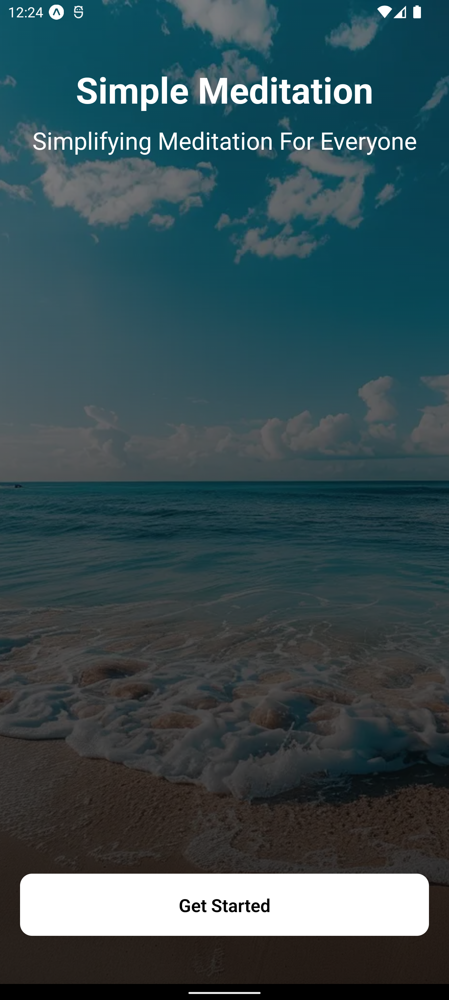
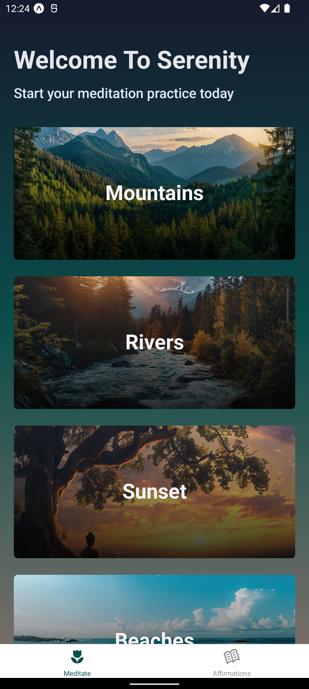
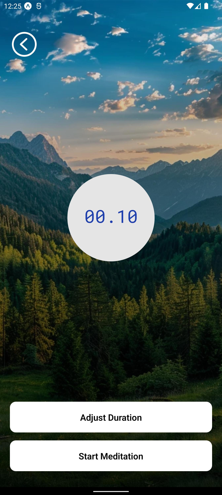
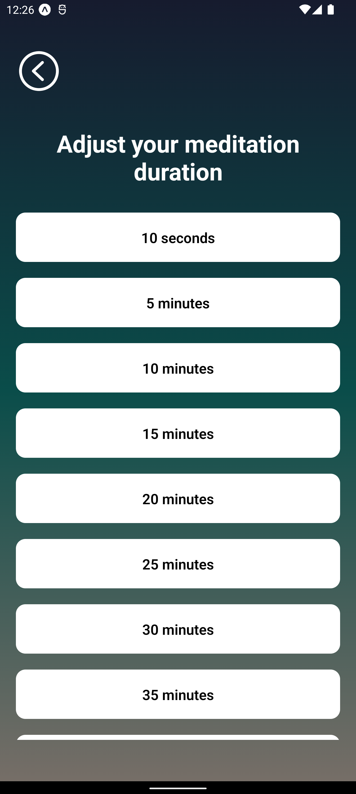
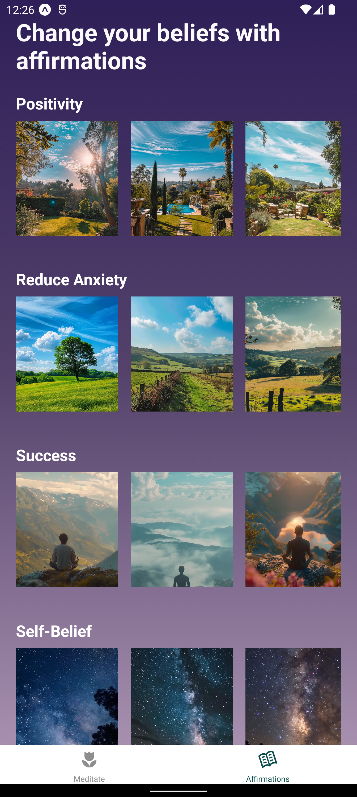

# Get started

- [Click Here To Download Apk and run on android device](https://expo.dev/artifacts/eas/6Yk1xcDsYQ5bnuA123D8KN.apk) <https://expo.dev/artifacts/eas/6Yk1xcDsYQ5bnuA123D8KN.apk>

# Run On Your Device

1. Install dependencies

   ```bash
   yarn install
   ```

2. Start the app

   ```bash
    yarn start
   ```

In the output, you'll find options to open the app in a

- [development build](https://docs.expo.dev/develop/development-builds/introduction/)
- [Android emulator](https://docs.expo.dev/workflow/android-studio-emulator/)
- [iOS simulator](https://docs.expo.dev/workflow/ios-simulator/)
- [Expo Go](https://expo.dev/go), a limited sandbox for trying out app development with Expo

You can start developing by editing the files inside the **app** directory. This project uses [file-based routing](https://docs.expo.dev/router/introduction/).

# App Screenshots

|  |  |  |
|:---------------------------------------------:|:--------------------------------------:|:---------------------------------:|
| Get Started Screen                            | Welcome Screen                         | Timer Screen                      |

|  |  |  |
|:---------------------------------------------:|:-------------------------------------------------:|:--------------------------------------:|
| Adjust Timer Screen                           | Affirmations Category Screen                       | Affirmation Screen                     |

---
